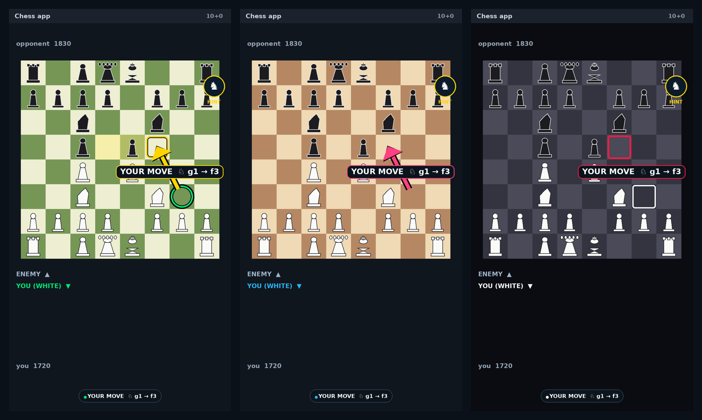
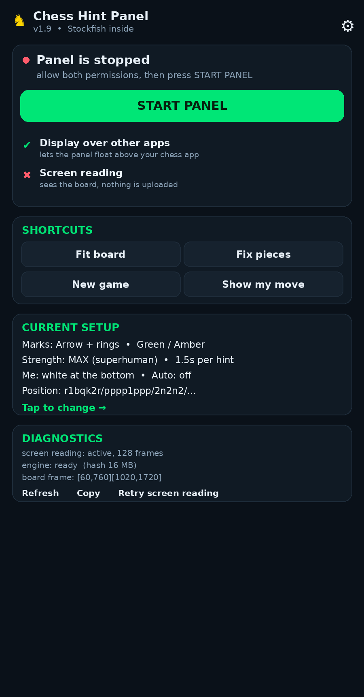
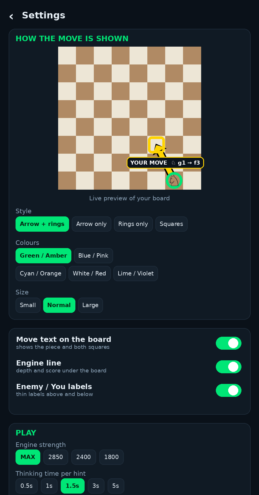
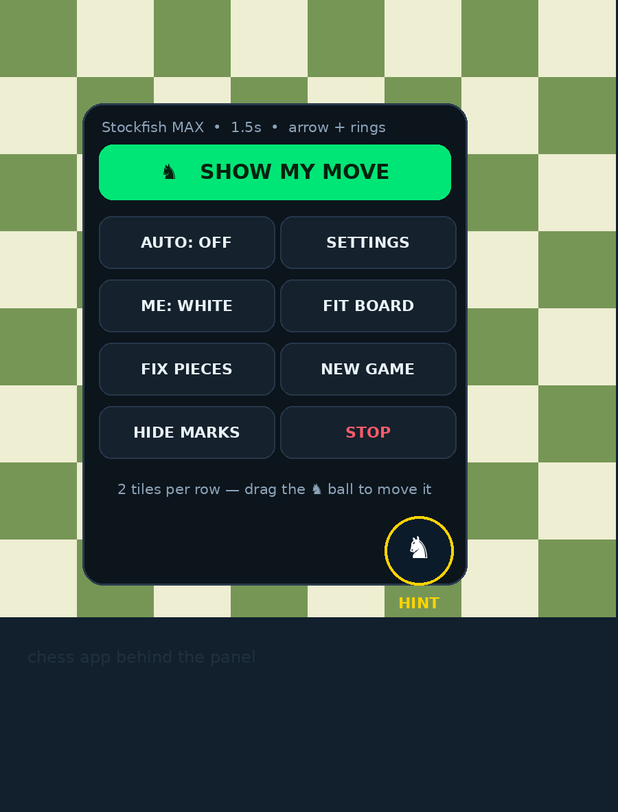
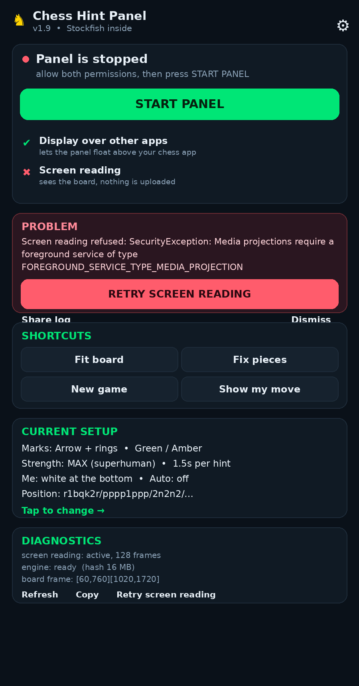
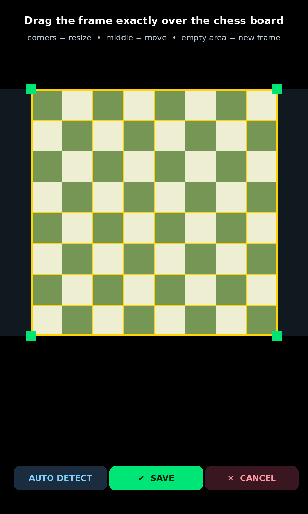
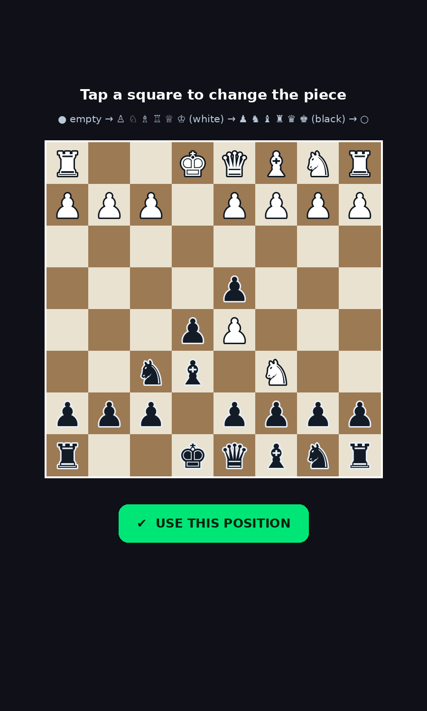
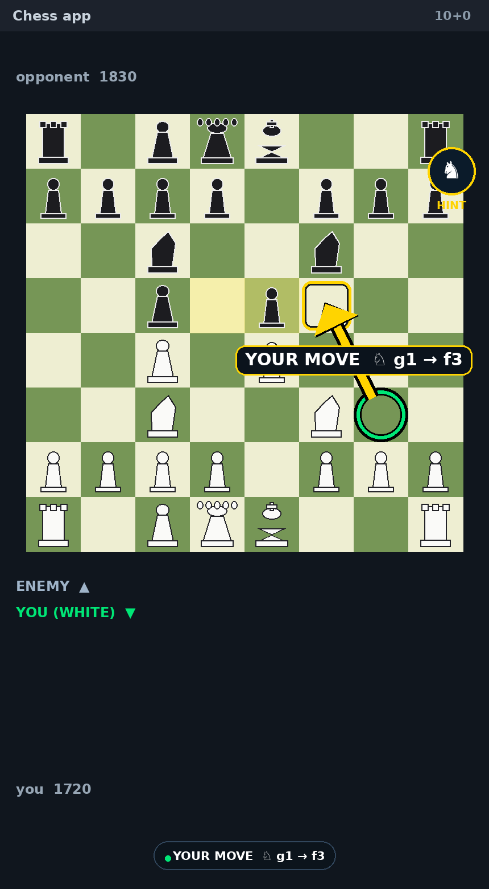
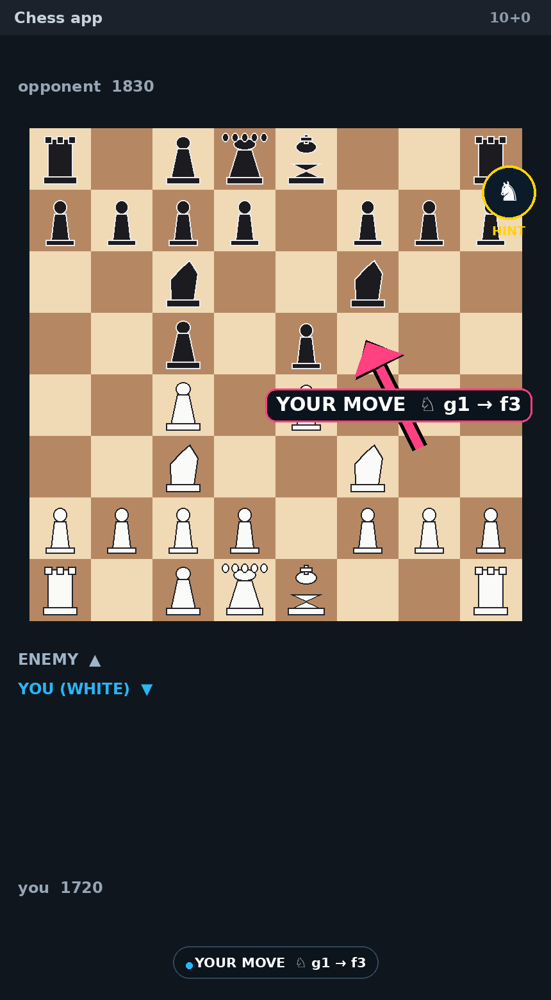
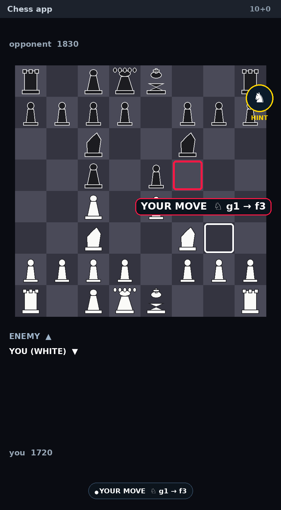

<div align="center">



# ♞ Chess Hint Panel

**A floating chess coach for Android.**
It watches *any* chess app through the screen-capture API, thinks with its own **Stockfish 11**
engine and draws the move you should play — **arrow, rings and the piece name, right on your
board**. No root, no hooks into other apps, no internet.

[](../../actions/workflows/build.yml)
[](../../releases/latest)
[](../../releases)


%20%2B%20GPLv3%20(engine)-yellow)

### [⬇ **Download the APK**](../../releases/latest) &nbsp;·&nbsp; [📥 Install guide](docs/INSTALL.md) &nbsp;·&nbsp; [🎛 Settings](docs/SETTINGS.md) &nbsp;·&nbsp; [🔧 Build](docs/BUILDING.md) &nbsp;·&nbsp; [❓ FAQ](docs/FAQ.md) &nbsp;·&nbsp; [🔒 Privacy](docs/PRIVACY.md)

</div>

---

## 📱 The app

| Home | Settings — live preview | Floating panel |
|:---:|:---:|:---:|
|  |  |  |
| Two permissions, one button, diagnostics with a shareable log | Pick the mark style, colours and size — the preview shows exactly what your board will look like | Tap the floating ♞ anywhere, drag it around, tiles for every action |

| When something goes wrong | Fitting the board | Fixing the pieces |
|:---:|:---:|:---:|
|  |  |  |
| The panel never crashes: it tells you the real reason, offers **Retry screen reading** and a **Share log** button | Drag the frame exactly over the board — corners to resize, middle to move | Joined a game mid-way? Tap the squares once to set the exact position |

## ✨ Features

| | |
|---|---|
| 🎯 **Tells you the move** | Green ring on the piece, amber ring on the target square, a fat arrow between them and a badge like `YOUR MOVE ♘ g1 → f3`. |
| 🧠 **Real engine** | Official **Stockfish 11** compiled into the app for arm64 / armv7 / x86_64 — superhuman strength, **fully offline**. |
| 👁 **Any chess app** | chess.com, Lichess, Chess Play, offline games… it reads the screen like your eyes do. |
| 🙋 **Only *your* move** | Bottom half of the board = you, top = enemy. While the opponent thinks it stays silent — no cheating hints for the wrong side. |
| 🎨 **Your marks** | Arrow + rings · arrow only · rings only · filled squares — 5 colour sets, 3 sizes, optional text, engine line and labels. |
| ⚙️ **Auto mode** | Captures a frame a second and hints you automatically on every one of your turns. |
| 🛡 **Never crashes** | Every layer is guarded, the capture layer retries, and anything that goes wrong lands in a log you can read and share from the app. |
| 🔒 **Private** | No internet permission at all — nothing is uploaded, no accounts, no ads. |

## 📥 Install in 60 seconds

1. **Download** the APK → [Releases](../../releases/latest) or `apk/ChessHintPanel-v1.7.apk` in this repo.
2. Tap it → *"allow installing from this source"* → **Install**.
3. Open the app:
   * **ALLOW "DISPLAY OVER OTHER APPS"** → toggle **ON**
   * **START PANEL** → Android asks *"Start recording or casting?"* → **YES**
4. A small **♞ HINT** ball appears. Open your chess game and tap it → **SHOW MY MOVE**.

> Your pieces must be at the **bottom** of the board — if not, tap ♞ → **ME: WHITE/BLACK** or set
> *My side* in Settings.

## 🎛 Make it look how you want

<div align="center">



</div>

| Group | Options |
|---|---|
| **Marks** | style (arrow+rings / arrow / rings / squares) · colours (green-amber, blue-pink, cyan-orange, white-red, lime-violet) · size (S/M/L) · move text · engine line · labels · board frame · status pill |
| **Play** | my side · strength (MAX, 2850, 2400, 1800, 1400) · thinking time (0.5–5 s) · auto hints · vibrate |
| **Board** | fit frame · auto detect · fix pieces · new game · bubble size |

Every change is applied to the running panel instantly and previewed on a real board inside
Settings ([details](docs/SETTINGS.md)).

## 🧩 How it works

```
MediaProjection ─► ScreenGrab ─► Vision ─► Track ─► Stockfish 11 (JNI) ─► Markers ─► Overlay
                                   │          │
                    finds the board   keeps the piece TYPES exact by matching every
                    and the 64 squares   screen change to a legal move
```

* **Vision** — the board is found from grid-line contrast and checkerboard alternation, then each
  square is compared with **its own four corners**, so any theme works and highlighted squares
  (last move, check, move dots) are correctly read as *empty*.
* **Track** — the reader never guesses piece types. The tracker starts from a known position and,
  after every screen change, searches for the shortest legal move sequence that reproduces what
  was seen (1–3 plies, instant). Noisy reads are repaired by flipping the least certain squares.
* **Engine** — Stockfish runs inside the app process (`System.loadLibrary`, no `exec()`), so it
  works on every Android version including 10–15 with the strictest policies. The engine is asked
  **only for your side's move**.

More: [`docs/ARCHITECTURE.md`](docs/ARCHITECTURE.md)

## 🧪 Tested

```bash
tools/build-stockfish-host.sh                     # build the engine for the desktop
cd tools/tests && javac -d classes -sourcepath ../../app/java:. CoreTest.java VisionTest.java
java -Djava.library.path=../../build/host -cp classes:../../app/java CoreTest
```

* **Move generator** — perft counts verified against Stockfish itself (startpos d4 = 197 281, kiwipete d3 = 97 862, promotions, castling, en-passant) — all match.
* **Tracker** — replays a full opening from screen patterns only, catches 4 plies in one step, repairs misread squares.
* **Vision** — 6 synthetic board themes (light / dark / blue / busy background / highlights + move dots) → board located within a few pixels, 64/64 squares read (the one borderline square in one theme is auto-repaired by the tracker, and that is asserted in the test).
* **Engine** — mate-in-1, promotions, Elo-limited mode through the JNI bridge.

## 📦 All versions

| Version | APK | What changed |
|---|---|---|
| **1.7** *(latest)* | [apk/ChessHintPanel-v1.7.apk](apk/ChessHintPanel-v1.7.apk) | **Fixed crash when granting Screen Recording permission** (`MainActivity.onResume()` no longer calls `stopService()` immediately after `onActivityResult()` starts `OverlayService`, eliminating `ForegroundServiceDidNotStartInTimeException`; `ScreenGrab` no longer decodes 60 fps full-screen bitmaps on `onImageAvailable`, decoding lazily on demand inside `grab()`) |
| 1.6 | [apk/ChessHintPanel-v1.6.apk](apk/ChessHintPanel-v1.6.apk) | **Complete fix for "Could not read the screen"** (`ImageReader` on `chesshint-frames`, row-stride safe buffer copy, static-screen `lastBitmap` cache + SurfaceFlinger nudge, clean capture hiding old marks), **fixed duplicate floating icons & broken STOP** (unregistered `MediaProjection.Callback` before stop, synchronous 0 ms teardown, mid-game/new-game auto recovery) |
| 1.5 | [apk/ChessHintPanel-v1.5.apk](apk/ChessHintPanel-v1.5.apk) | `acquireLatestImage()` polling fallback, `StopReceiver` broadcast notification STOP, **TEST SCREEN READING** button |
| 1.4 | [apk/ChessHintPanel-v1.4.apk](apk/ChessHintPanel-v1.4.apk) | Dedicated frame thread, one-tap ✕ on floating ♞ bubble, **✖ STOP & CLOSE** and **HIDE ♞** in panel, stray window sweep |
| 1.3 | [apk/ChessHintPanel-v1.3.apk](apk/ChessHintPanel-v1.3.apk) | **Screen-recording crash fixed for Android 10–15** (foreground-service order is now version-correct with an automatic fallback), the panel never closes itself on capture errors — it shows the reason, a **Retry** button and a **Share log**; memory tuning per device (`Tune`), problem card in the app |
| 1.2 | [apk/ChessHintPanel-v1.2.apk](apk/ChessHintPanel-v1.2.apk) | Crash on *SHOW MY MOVE* fixed (memory + guards), no more surprise calibration frame, capture retry, Diagnostics card |
| 1.1 | [apk/ChessHintPanel-v1.1.apk](apk/ChessHintPanel-v1.1.apk) | Android 14 crash fixed, chrome-free overlay, Settings screen with live preview, marker styles |
| 1.0 | [apk/ChessHintPanel-v1.0.apk](apk/ChessHintPanel-v1.0.apk) | First release — Stockfish 11 via JNI, screen reader, game tracker, hint arrow |

Full history: [CHANGELOG.md](CHANGELOG.md)

## ⚖️ About "8000 Elo"

No chess engine reaches 8000 Elo. The strongest engines ever measured sit around **3600**, and
Stockfish at full strength **is** that ceiling — so the panel ships at **MAX**, and the strength
selector exists to *weaken* it (2850 → 1400) when you want a fair game instead of a demolition.

## ⚠️ Fair play

Engine assistance during online games breaks the rules of every chess platform and can get your
account banned. Use this for **learning, analysis and offline games**.

## 📄 License

* App source: **MIT** — see [LICENSE](LICENSE).
* Bundled engine: **[Stockfish 11](https://github.com/official-stockfish/Stockfish)** — **GPLv3**.
  It is compiled from unmodified official sources by `tools/build-stockfish-android.sh` +
  `native/jni_bridge.cpp`; anyone redistributing the APK must keep the licence and offer its source.

<div align="center"><sub>Built for players who want to learn and win — offline. ⭐ if it helped you.</sub></div>
